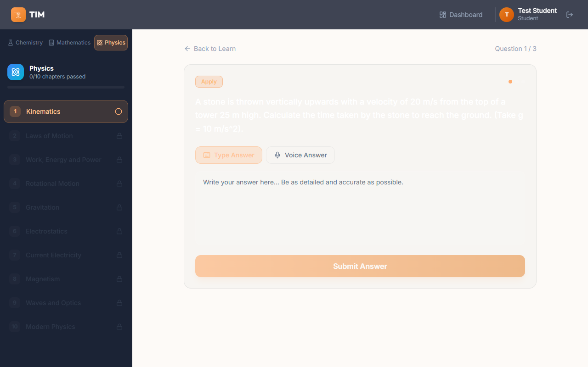
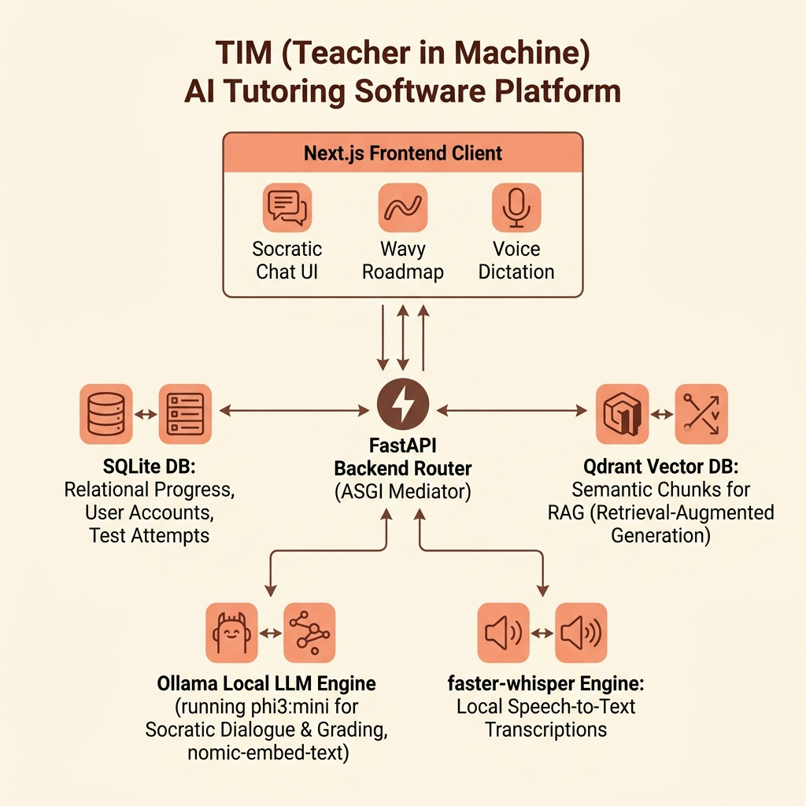

# 🎓 Teacher in Machine (TIM)

> **AI-Powered Adaptive Socratic Learning Platform for Physics, Chemistry, and Mathematics**

Teacher in Machine (TIM) is a premium, gamified study workspace designed to prepare students for competitive examinations (such as the JEE) using strict **Socratic tutoring methodologies** and **Bloom's Taxonomy progression**. 

Inspired by **Duolingo’s vibrant aesthetics**, the platform features satisfying 3D tactile buttons, interactive winding pathways, real-time voice dictation, and structured, high-precision grading.

---

## 📸 Platform Screenshots

### Home Page


### Winding Learning Roadmap Dashboard


### Socratic AI Tutor


### Socratic Answer Evaluation and Comparison


### Admin Questions and Topic Dashboard


---

## 🛠️ System Architecture

TIM runs entirely in a **fully optimized local environment** without external API dependencies. Below is the data flow and system structure:

```
                  ┌──────────────────────────────────────────┐
                  │                 Browser                  │
                  │         Next.js Frontend (React)         │
                  └─────────────┬────────────────────▲───────┘
                                │ HTTP API           │ WebSocket / SSE
                                ▼                    │
                  ┌──────────────────────────────────┴───────┐
                  │             FastAPI Backend              │
                  │           Python & SQLAlchemy            │
                  └──────┬──────────────┬──────────────┬─────┘
                         │              │              │
        ┌────────────────▼──┐    ┌──────▼──────┐   ┌───▼───────────┐
        │  SQLite Database  │    │ Qdrant Vector│   │ Local Ollama  │
        │    (jeeapp.db)    │    │ DB (RAG Context)│   │ (tim-tutor /  │
        │                   │    │             │   │  phi3:mini)   │
        └───────────────────┘    └─────────────┘   └───────────────┘
```



---

## ✨ Key Features

### 1. Duolingo-Inspired Learning Roadmaps
* **Visual Milestones**: Interactive winding maps representing learning paths. Unlocked chapters glow, completed chapters turn gold, and future chapters are securely locked.
* **Tactile 3D UX**: Satisfying tactile click interactions on buttons and navigation tabs built with custom CSS.

### 2. Socratic Chat Advisor (`tim-tutor`)
* **Local LLM**: Built upon a custom model wrapper on `phi3:mini` running locally on your hardware.
* **Socratic Guardrails**: The tutor never reveals final answers immediately. It provides targeted suggestions, checks for misunderstandings, and guides the student using leading questions.
* **LaTeX Formula Formatting**: Fully supports math rendering. Equations like $s = ut + \frac{1}{2}at^2$, physical variables ($v, u, a, t$), and chemical symbols ($H_2O, CO_2$) are typeset cleanly using ReactMarkdown and KaTeX.

### 3. Strict Pedagogical Gating
* **Bloom's Taxonomy Sorting**: Questions are structured in three ascending stages: **Remember** $\rightarrow$ **Understand** $\rightarrow$ **Apply**.
* **Chapter Lock Constraints**: The next chapter remains strictly locked until the student has attempted all active questions inside the current topic and achieved an average score above the threshold.

### 4. Advanced Evaluation Rubric
* **Multi-Dimensional Grading**: Student answers are graded on a 0-10 scale across three sub-scores:
  * *Concept Score* (0-3)
  * *Formula Score* (0-3)
  * *Completeness & Reasoning* (0-4)
* **Structured JSON Grader**: Runs JSON-constrained schema validation in Ollama to deliver grading feedback in under 7 seconds with 100% parsing accuracy.
* **Comparison Panel**: Displays a side-by-side view comparing the student's submission directly to the expected rubric answer keys.

### 5. Browser-Native Voice Dictation
* Uses the HTML5 `SpeechRecognition` web browser API.
* Allows students to dictate questions to their tutor. Text translates instantly in a live-typing feed inside the input area.

### 6. Admin Control Center
* Manage student records.
* Toggle evaluation flags and monitor anticheat metrics.
* Manually author questions or run the PDF indexer.
* Link lecture videos and index educational materials.

---

## 🚀 Getting Started

### Prerequisites
1. **Ollama**: Download and install [Ollama](https://ollama.com). Ensure the service is running locally (`http://localhost:11434`).
2. **Python 3.10+**: Ensure Python is added to your environment `PATH`.
3. **Node.js 18+**: For running the React frontend.

---

### Setup Instructions

TIM includes an automated PowerShell script to install dependencies, run migrations, pull models, and seed the database in one click.

1. **Run the Setup Script**:
   Open a PowerShell terminal in the project root and run:
   ```powershell
   powershell -ExecutionPolicy Bypass -File setup.ps1
   ```
   *This script will:*
   * Upgrade pip and establish a Python virtual environment (`backend/.venv`).
   * Apply database migrations via Alembic.
   * Pull `qwen2.5:0.5b`, `nomic-embed-text`, and `phi3:mini` locally via Ollama.
   * Construct the custom `tim-tutor` Socratic LLM model.
   * Seed the 10-chapter curriculum, 90 curated questions, and video lectures.
   * Generate RAG text embeddings and index study materials.
   * Run `npm install` for frontend packages.

2. **Run the Project (VS Code Task Automation)**:
   If using VS Code, press `Ctrl + Shift + B` (or run "Run Build Task") to launch both Next.js and FastAPI servers concurrently.

3. **Manual Execution**:
   * **Start Backend**:
     ```powershell
     cd backend
     .venv\Scripts\python.exe -m uvicorn app.main:app --port 8000 --reload
     ```
   * **Start Frontend**:
     ```powershell
     cd frontend
     npm run dev
     ```
   * **Launch App**: Open your browser and navigate to `http://localhost:3000`.

---

## 🧪 Technical Specs

* **Backend**: FastAPI, SQLAlchemy Async, Alembic migrations, Celery.
* **Vector DB**: Local Qdrant server for topic-restricted semantic search (RAG).
* **Frontend**: Next.js 14, TailwindCSS, React Query, Framer Motion, ReactMarkdown + Rehype-Katex.
* **Local Inference**: Ollama (`phi3:mini` for grader / tutor, `nomic-embed-text` for vector indexing).
